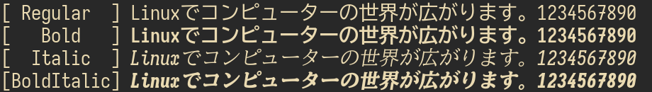

# East Asian Widthフォント

このフォントはターミナルで上で起こるEast Asian Width問題を緩和し、
文字が自然に表示されることをコンセプトとした合成フォントです。

East Asian Width問題はLinuxのターミナル表示が壊れる厄介な問題です。
これを解決するための[修正ロケール](https://github.com/hamano/locale-eaw)を公開していますが
フォントに依存して不自然な表示となるのでフォントも調整する必要がありました。

[locale-eaw](https://github.com/hamano/locale-eaw)との組み合わせにより、glibcロケール、シェル、ターミナル、テキストエディタ、フォントの文字幅を全て一致させることで快適で壊れないなターミナル環境を実現します。

# フォントにまつわるEAW問題
- 重なる

- 縮む

- 切れる

[修正ロケール](https://github.com/hamano/locale-eaw)とこのフォントの組み合わせによって上記の問題を解決します。

# 特徴

- 視認性の高いプログラミング、ターミナル作業向けフォント
- Regular, Bold, Italic, BoldItalicの4書体
- 見える全角スペース
- 絵文字、NerdFontを幅広くサポート
- East Asian Width問題により、文字が潰れない、重ならない

このフォントは現状下記フォントを合成していますが、
今後よりよいフォントがあれば入れ替えを行う可能性があります。

- Iosevka Curly
- BIZ UDGothic
- Nerd Fonts
- Noto Emoji

# フレーバー

このフォントは以下のフレーバーを提供します。

## EAW-CONSOLE
AmbiguousとNeutralの文字幅を個別に裁定

- 半角にしないとTUIが壊れる文字は半角(罫線・ブロック)
- 日本語圏で全角として扱われることが多い文字は全角(例※①)
- NerdFontのプライベート領域を全角
- 半角で描画することが困難な絵文字を全角

修正ロケール[EAW-CONSOLE](https://github.com/hamano/locale-eaw)の文字幅と一致するフォントです。

## EAW-FULLWIDTH
- East Asian Width=Ambisious文字をすべて全角にしたフォント
- Ambisious Widthを全角に統一するしかない、古典的なアプリケーションに適応します。
- 罫線が全角となるのでTUIが壊れます。
- EAW=Nerutralな文字が半角となるので潰れる絵文字があります。
- ギリシャ文字やキリル文字が全角となります。

修正ロケール[EAW-FULLWIDTH](https://github.com/hamano/locale-eaw)の文字幅と一致するフォントです。

### サンプル

[sample.txt](https://github.com/hamano/font-eaw/raw/refs/heads/main/sample/sample.txt)
をお気に入りのテキストエディタで問題なく編集できるか試してみよう!

## イタリック体の再考

ターミナルではイタリック体やボールド体に文字を修飾できます。
欧文のイタリック体は特徴的ですが、和文ではただの斜体ですのでそれほど変化がありません。

そこで、このフォントのイタリック体は欧文ではセリフ付きイタリック体、和文では明朝体の斜体にするという実験を行っています。

これにより和文でもイタリック体が区別しやすくなることを期待しています。

## プログレスバー

Fira Code由来のプログレスバーを利用できます。

# ライセンス

SIL Open Font License v1.1
